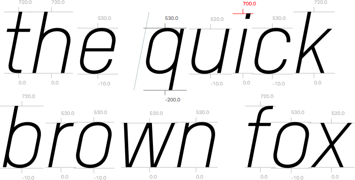

# ShowTopsAndBottoms.glyphsReporter

This is a plugin for the [Glyphs font editor](http://glyphsapp.com/) by Georg Seifert. It displays the bounding box tops and bottoms for each glyph in the Edit view, and marks them red if they are not inside an alignment zone.

After installation, it will add the menu item *View > Show Tops and Bottoms* (es: *Mostrar superiores e inferiores,* de: *Höchste und tiefste Stellen anzeigen,* nl: *Toon hoogste en laagste plekken,* fr: *Afficher les hauts et les bas,* zh: 显示底部到顶点的数值). You can set a keyboard shortcut in System Preferences.

### Installation

1. Download the complete ZIP file and unpack it, or clone the repository.
2. Double click the .glyphsReporter file. Confirm the dialog that appears in Glyphs.
3. Restart Glyphs

### Usage Instructions

1. Open a glyph in Edit View.
2. Use *View > Show Tops and Bottoms* to toggle the display of bbox tops and bottoms.

### Requirements

The plugin works in Glyphs 2.2 or later, on OS X 10.11 or later. I can only test it in current app and OS versions, and perhaps it works on earlier versions too.

### License

Copyright 2015 Rainer Erich Scheichelbauer (@mekkablue).
Based on sample code by Georg Seifert (@schriftgestalt).

Licensed under the Apache License, Version 2.0 (the "License");
you may not use this file except in compliance with the License.
You may obtain a copy of the License at

http://www.apache.org/licenses/LICENSE-2.0

See the License file included in this repository for further details.
